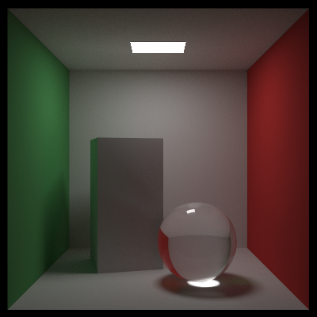

# Rust Raytracer

A Rust ray tracer based on the C++ ray tracer originally written by Peter Shirley for his [_Ray Tracing_ book series](https://raytracing.github.io/).

<figure>
    
</figure>

## Usage

The `raytracer` library will be built by `cargo build` and can be imported into custom driver programs. Currently, scenes can only be created programatically.

## Examples

Example driver programs are under `examples` and can be ran with `cargo run --release --example <EXAMPLE> -- --height <HEIGHT> --width <WIDTH> [options]`. Run `cargo run ... -- --help` to see all options. Most settings (dimensions, fov, depth of field, etc.) can be changed, with the exceptions of the camera origin and direction.

## Todo

- Update Book 1 & 2 examples to run with latest changes
- Add triangle mesh rendering
