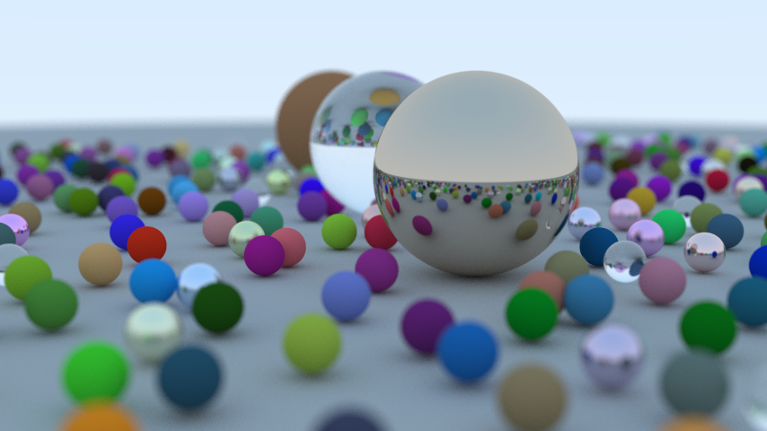

# Rust Raytracer

A Rust ray tracer based on the C++ ray tracer originally written by Peter Shirley for his [_Ray Tracing_ book series](https://raytracing.github.io/).

<figure>
    
    <figcaption style="text-align:center;">examples/book1 output using options: -w 854 -h 480 -d 100 -s 500 --fov 25 -a 0.2</figcaption>
</figure>

## Usage

The `raytracer` library will be built by `cargo build` and can be imported into custom driver programs. The `--release` flag should be used when rendering, for the performance gain.

## Examples

Example driver programs are under `examples` and can be ran with `cargo run --release --example <EXAMPLE> -- --height <HEIGHT> --width <WIDTH> [options]`. Run `cargo run ... -- --help` to see all options. Most settings (dimensions, fov, depth of field, etc.) can be changed, with the exceptions of the camera origin and direction.

## Release History

- 0.1.0
  - Library and example scene for book 1, [_Ray Tracing in One Weekend_](https://raytracing.github.io/books/RayTracingInOneWeekend.html), completed, including parallelization using [Rayon](https://crates.io/crates/rayon) and saving in multiple formats using [image](https://crates.io/crates/image).
